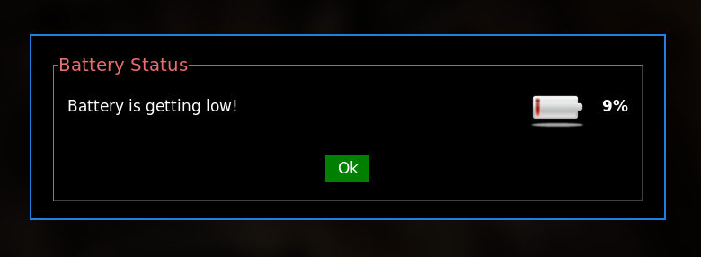

[](https://github.com/prettier/prettier)


# Battery Status Notifier (bsnotifier)

Command line application that shows a popup window when the battery is low. This Python script can be used to notify
battery status in [i3wm](https://i3wm.org/) environments.



# Table of contents

* [Get started](#get-started)
  * [Installation](#installation)
  * [Usage](#usage)
  * [How to use it with i3](#how-to-use-it-with-i3)
  * [Options](#options)
* [Developers](#developers)
  * [Testing release with Tox](#testing-release-with-Tox)
    * [Requirements](#requirements)
    * [Set Python versions](#set-python-versions)
    * [Run](#run)
  * [Static code analysis tools](#static-code-analysis-tools)
    * [Set up the Git hooks custom directory](#set-up-the-git-hooks-custom-directory)
    * [Python Static Checkers](#python-static-checkers)
    * [Shell Static Checkers](#shell-static-checkers)
    * [Run using Tox - recommended](#run-using-tox---recommended)
    * [Run manually](#run-manually)
* [License](#license)
* [Changelog](#changelog)

# Get started

## Installation

This application can be simply installed by running:

```bash
pip install bsnotifier
```

if you want to install from a source distribution:

```bash
git clone https://github.com/eccanto/battery-status-notifier
cd battery-status-notifier/
python setup.py install
```

## Usage

To start the notifier you must run the command line application:

```bash
bsnotifier
```

By default the application will check the battery status every `1:30 minutes`, if the battery percentage is less than
`10%` a popup window will be shown.

## How to use it with i3

Auto start the notifier application in i3:

1. Linking the application executable to make it accessible to other users.

    ```bash
    BSNOTIFIER_PATH="$(which bsnotifier)"
    sudo ln -s "${BSNOTIFIER_PATH}" /usr/bin/bsnotifier
    ```

2. Edit i3 config file.

    ```bash
    # ~/.config/i3/config
    ...
    exec --no-startup-id bsnotifier -o "$(mktemp)"
    ...
    ```

## Options

```bash
$ bsnotifier --help

Usage: bsnotifier [OPTIONS]

  Command line application that shows a popup window when the battery is low.

Options:
  -i, --interval INTEGER  The time interval in seconds that the script waits
                          before checking the battery again (default: 150.0
                          seconds).
  -l, --level INTEGER     The battery percentage at which the popup window is
                          displayed (default: 10).
  -s, --silent            Do not play the sound when popup window is
                          displayed.
  -o, --output PATH       Log file path (default: .bsnotifier.log).
  --help                  Show this message and exit.
```

# Developers

## Testing release with Tox

### Requirements

Python requirements:

```bash
pip3 install -r requirements_testing.txt
```

### Set Python versions

1. Install [pyenv](https://github.com/pyenv/pyenv)
2. Install python versions:
    ```bash
    for python_version in "3.7" "3.8" "3.9" "3.10" "3.11" ; do pyenv install ${python_version}; done
    ```
3. Enable python versions:
    ```bash
    pyenv local "3.7" "3.8" "3.9" "3.10" "3.11"
    ```

### Run

We use [tox](https://tox.wiki/en/latest/) and [pytest](https://docs.pytest.org/en/6.2.x) to run the
test suite:

```bash
tox
```

to run the test suite for a particular Python version, you can do:


```bash
tox -e py37
```

## Static code analysis tools

These are the linters that will help us to follow good practices and style guides of our source code. We will be using the following static analysis tools, which will be executed when generating a new push in the repository (git hooks).

### Set up the Git hooks custom directory

After cloning the repository run the following command in the repository root:

```bash
git config core.hooksPath .githooks
```

### Python Static Checkers

Tools used:
- [brunette](https://github.com/odwyersoftware/brunette): A best practice Python code formatter.
- [isort](https://pycqa.github.io/isort/): Python utility / library to sort imports alphabetically, and automatically separated into sections and by type.
- [prospector](https://github.com/PyCQA/prospector): Prospector is a tool to analyse Python code and output information about errors, potential problems, convention violations and complexity.

  Tools executed by Prospector:
  - [pylint](https://github.com/PyCQA/pylint): Pylint is a Python static code analysis tool which looks for programming errors,   helps enforcing a coding standard, sniffs for code smells and offers simple refactoring suggestions.
  - [bandit](https://github.com/PyCQA/bandit): Bandit is a tool designed to find common security issues.
  - [dodgy](https://github.com/landscapeio/dodgy): It is a series of simple regular expressions designed to detect things such as accidental SCM diff checkins, or passwords or secret keys hard coded into files.
  - [mccabe](https://github.com/PyCQA/mccabe): Complexity checker.
  - [mypy](https://github.com/python/mypy): Mypy is an optional static type checker for Python.
  - [pydocstyle](https://github.com/PyCQA/pydocstyle): pydocstyle is a static analysis tool for checking compliance with Python [PEP 257](https://peps.python.org/pep-0257/).
  - [pycodestyle](https://pycodestyle.pycqa.org/en/latest/): pycodestyle is a tool to check your Python code against some of the style conventions in [PEP 8](https://peps.python.org/pep-0008/).
  - [pyflakes](https://github.com/PyCQA/pyflakes): Pyflakes analyzes programs and detects various errors.
  - [pyroma](https://github.com/regebro/pyroma): Pyroma is a product aimed at giving a rating of how well a Python project complies with the best practices of the Python packaging ecosystem, primarily PyPI, pip, Distribute etc, as well as a list of issues that could be improved.

### Shell Static Checkers

Tools used:
- [shellcheck](https://www.shellcheck.net/): Finds bugs in your shell scripts (bash).

  Installation:

  ```bash
  apt install shellcheck
  ```

### Run using Tox - recommended

```bash
tox -e code_checkers
```

### Run manually

```bash
bash scripts/code_checkers.sh
```

# License

[MIT](./LICENSE)

# Changelog

- 1.0.0 - Initial version.
- 1.0.1 - I3 support.
- 1.0.2 - Close the popup window when connecting the battery, and update the information in real time.
